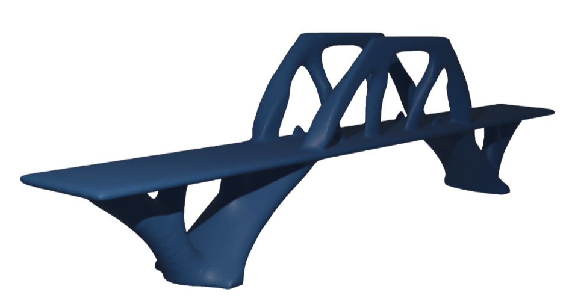
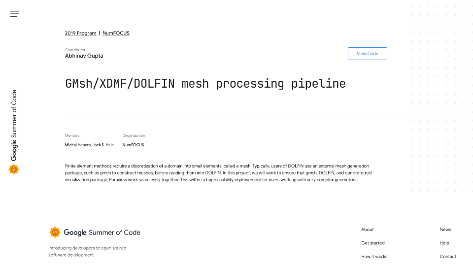
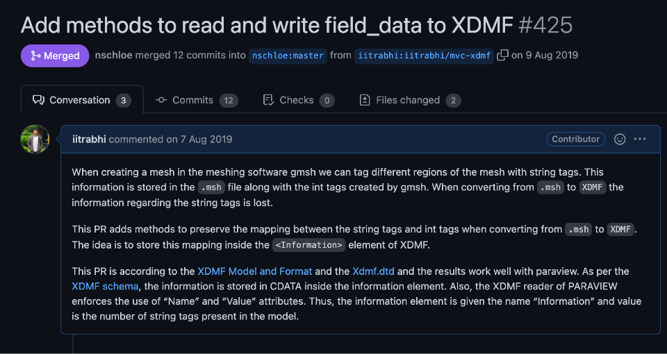

# Projects

Some of my projects (or that I have contributed to):

- [Topology optimization in FEniCS](https://github.com/iitrabhi/topo-fenics): Even before starting my PhD, I had a strong inclination towards python and had a desire to do my work using only opensource environment. Fortunately, I found FEniCS, while searching for some documentation on PETSc. It has best of both worlds, the speed of C++ and the ease of python. I had a strong belief that coding the topology optimization problem in FEniCS could result in a highly readable code as opposed to other existing implementations. This resulted in the development of the smallest code for 2D+3D parallel implementation of topology optimization-[The 55-line code of topology optimization](https://www.researchgate.net/publication/347300347_A_55-line_code_for_large-scale_parallel_topology_optimization_in_2D_and_3D). 

- [**FEniCS**](https://fenicsproject.org/): It's an awesome open-source package to solve differential equations using the finite element method. I was lucky enough to get accepted in the google summer of code to work on the mesh processing pipeline in the new version of FEniCS, tag named FEniCS-X. You can find more about my experience [here](https://computationalmechanics.in/fenics-the-mesh-workflow/). I was also interview by numfocus during GSoC and you can find that [here](https://numfocus.org/blog/meet-our-2019-gsoc-students-part-1). The output of the program is mentioned on the google-summer-of-code website [here](https://summerofcode.withgoogle.com/archive/2019/projects/4659097339691008).

  

- [**meshio**](https://github.com/nschloe/meshio): We use meshio everyweek to convert models between different mesh type. The package is designed by [Nico Schlomer](https://twitter.com/nschloe) who has been my inspiration in the world of scientific computing. During the GSoC program, I had an assignement  to add some functionallity to the `meshio` package. The PR for that is [here](https://github.com/nschloe/meshio/pull/425). So happy that the PR was upto his standards and got merged into the package😊.

  
  
  
